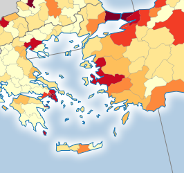
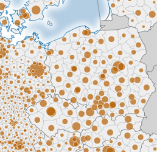
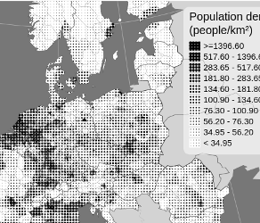

# eurostat-map.js

Reusable library to publish web maps showing Eurostat data.

## Examples

* [Population density map](https://bl.ocks.org/jgaffuri/raw/0d6e1b1c6f9e1297829f38b9c37737fe/) (see [the code](https://bl.ocks.org/jgaffuri/0d6e1b1c6f9e1297829f38b9c37737fe))
* [Population density map with dot pattern](https://bl.ocks.org/jgaffuri/raw/c8b99b207bb80a923bf1fd19f5d6de7e/) (see [the code](https://bl.ocks.org/jgaffuri/c8b99b207bb80a923bf1fd19f5d6de7e))
* [Population map with proportional circles](https://bl.ocks.org/jgaffuri/raw/cf5f187bd195f9c8771a1a3a4898079a/) (see [the code](https://bl.ocks.org/jgaffuri/cf5f187bd195f9c8771a1a3a4898079a))

## Usage

TODO Dependencies
TODO code start

## API

TODO

## Technical details

Maps based on [NUTS regions](http://ec.europa.eu/eurostat/web/nuts/overview) rely on [Nuts2json API](https://github.com/eurostat/Nuts2json/blob/gh-pages/README.md) and [TopoJSON](https://github.com/mbostock/topojson/wiki) format. Statistical data are accessed using [Eurostat REST webservice](http://ec.europa.eu/eurostat/web/json-and-unicode-web-services/getting-started/rest-request) for [JSON-stat](https://json-stat.org/) data. The data are decoded and queried using [JSON-stat library](https://json-stat.com/). Maps are rendered as SVG maps using [D3.js library](https://d3js.org/).

## Support and contribution

Feel free to [ask support](https://github.com/eurostat/eurostat.js/issues/new), fork the project or simply star it (it's always a pleasure).
